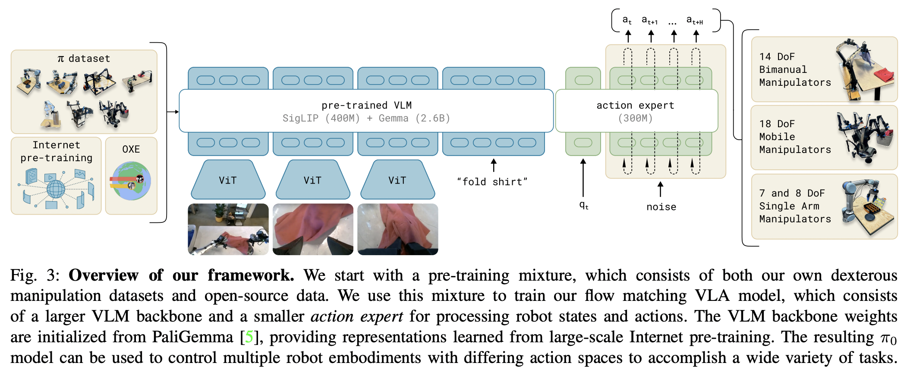

</img>

## pi-zero-pytorch (wip)

Implementation of <a href="https://www.physicalintelligence.company/blog/pi0">π₀</a> the robotic foundation model architecture proposed by Physical Intelligence

Summary of this work would be that it is a simplified <a href="https://github.com/lucidrains/transfusion-pytorch">Transfusion</a> (Zhou et al.) with influence from <a href="https://arxiv.org/abs/2403.03206">Stable Diffusion 3</a> (Esser et al.), mainly the adoption of flow matching instead of diffusion for policy generation, as well as the separation of parameters (<a href="https://github.com/lucidrains/mmdit/blob/main/mmdit/mmdit_pytorch.py#L43">Joint Attention</a> from mmDIT). They build on top of a pretrained vision language model, PaliGemma 2B.

### Install

```bash
$ pip install pi-zero-pytorch
```

### Usage

```python
import torch
from pi_zero_pytorch import π0

model = π0(
    dim = 512,
    dim_action_input = 6,
    dim_joint_state = 12,
    num_tokens = 20_000
)

vision = torch.randn(1, 1024, 512)
commands = torch.randint(0, 20_000, (1, 1024))
joint_state = torch.randn(1, 12)
actions = torch.randn(1, 32, 6)

loss, _ = model(vision, commands, joint_state, actions)
loss.backward()

# after much training

sampled_actions = model(vision, commands, joint_state, trajectory_length = 32) # (1, 32, 6)
```

### Contributing

At the project root, run

```bash
$ pip install '.[test]' # or `uv pip install '.[test]'`
```

Then add your tests to `tests/test_pi_zero.py` and run

```bash
$ pytest tests/
```

That's it

### Citation

```bibtex
@misc{Black2024,
    author  = {Kevin Black, Noah Brown, Danny Driess, Adnan Esmail, Michael Equi, Chelsea Finn, Niccolo Fusai, Lachy Groom, Karol Hausman, Brian Ichter, Szymon Jakubczak, Tim Jones, Liyiming Ke, Sergey Levine, Adrian Li-Bell, Mohith Mothukuri, Suraj Nair, Karl Pertsch, Lucy Xiaoyang Shi, James Tanner, Quan Vuong, Anna Walling, Haohuan Wang, Ury Zhilinsky},
    url     = {https://www.physicalintelligence.company/download/pi0.pdf}
}
```

```bibtex
@inproceedings{Zhou2024ValueRL,
    title   = {Value Residual Learning For Alleviating Attention Concentration In Transformers},
    author  = {Zhanchao Zhou and Tianyi Wu and Zhiyun Jiang and Zhenzhong Lan},
    year    = {2024},
    url     = {https://api.semanticscholar.org/CorpusID:273532030}
}
```

```bibtex
@inproceedings{Darcet2023VisionTN,
    title   = {Vision Transformers Need Registers},
    author  = {Timoth'ee Darcet and Maxime Oquab and Julien Mairal and Piotr Bojanowski},
    year    = {2023},
    url     = {https://api.semanticscholar.org/CorpusID:263134283}
}
```

```bibtex
@article{Li2024ImmiscibleDA,
    title   = {Immiscible Diffusion: Accelerating Diffusion Training with Noise Assignment},
    author  = {Yiheng Li and Heyang Jiang and Akio Kodaira and Masayoshi Tomizuka and Kurt Keutzer and Chenfeng Xu},
    journal = {ArXiv},
    year    = {2024},
    volume  = {abs/2406.12303},
    url     = {https://api.semanticscholar.org/CorpusID:270562607}
}
```

```bibtex
@inproceedings{Sadat2024EliminatingOA,
    title   = {Eliminating Oversaturation and Artifacts of High Guidance Scales in Diffusion Models},
    author  = {Seyedmorteza Sadat and Otmar Hilliges and Romann M. Weber},
    year    = {2024},
    url     = {https://api.semanticscholar.org/CorpusID:273098845}
}
```

```bibtex
@article{Bulatov2022RecurrentMT,
    title   = {Recurrent Memory Transformer},
    author  = {Aydar Bulatov and Yuri Kuratov and Mikhail S. Burtsev},
    journal = {ArXiv},
    year    = {2022},
    volume  = {abs/2207.06881},
    url     = {https://api.semanticscholar.org/CorpusID:250526424}
}
```

```bibtex
@inproceedings{Bessonov2023RecurrentAT,
    title   = {Recurrent Action Transformer with Memory},
    author  = {A. B. Bessonov and Alexey Staroverov and Huzhenyu Zhang and Alexey K. Kovalev and D. Yudin and Aleksandr I. Panov},
    year    = {2023},
    url     = {https://api.semanticscholar.org/CorpusID:259188030}
}
```

[*dear alice*](https://www.youtube.com/watch?v=z-Ng5ZvrDm4)
